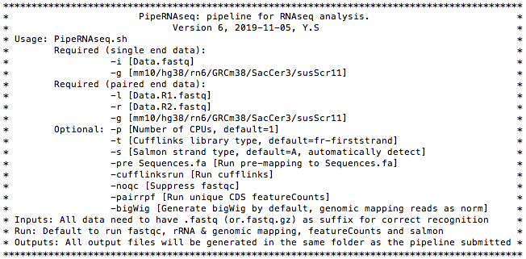

# PipeRNAseq
A comprehensive pipeline for RNAseq data analysis

## Software prerequisites
This pipeline is designed to run on Linux servers (but can also be used on Mac OS), and requires the following software:

They need to be installed and added to the $PATH before using the pipeline.
```
bowtie2
STAR
bedtools
samtools
salmon
featureCount (from Subread)
fastqc (optional)
cufflinks (optional)
```
Besides the pipeline script PipeRNAseq.sh, dependencies are in ./bin folder

One UCSC tools (from http://hgdownload.soe.ucsc.edu/admin/exe/) is used: bedGraphToBigWig.

Some codes may not work on Mac OS, and bedGraphToBigWig for Mac version can be downloaded here: http://hgdownload.soe.ucsc.edu/admin/exe/macOSX.x86_64, and need to be saved in ./bin folder

Also, for Mac OS, set the pipeline home directory at PipeRNAseq.sh line 59 manually (and comment out line 57):
`HomeDir="/Users/yusun/Downloads/PipelineHomeDir"`

## Pipeline setup

Here is an example of mm10 genome setup. If you have installed PipeRiboseq.sh pipeline before, then some folders are compatible don't need to be set up again.

0, Files

For mm10, hg38, rn6 and susScr11, some annotation files have been prepared in the repository. 

For other species, follow the pipeline component of mm10 to generate dependent files.

1, Download scripts from github to Linux server:

```
git clone https://github.com/sunyumail93/PipeRNAseq.git
mv PipeRNAseq PipelineHomeDir
```

2, Set up index files for genome mapping

2a, Download whole genome fasta sequence and chromosome sizes from UCSC goldenpath:

```
cd PipelineHomeDir/mm10/Sequence
wget http://hgdownload.cse.ucsc.edu/goldenPath/mm10/bigZips/mm10.fa.gz
gunzip *.gz
wget "http://hgdownload.cse.ucsc.edu/goldenPath/mm10/bigZips/mm10.chrom.sizes" -O mm10.ChromInfo.txt
```

2b, Extract RNA sequences
```
cd PipelineHomeDir/mm10/Annotation
gunzip *.gz
cd ../Sequence
bedtools getfasta -s -split -name -fi mm10.fa -bed ../Annotation/mm10.RefSeq.reduced.bed12 -fo mm10.RefSeq.reduced.bed12.fa.t
cat mm10.RefSeq.reduced.bed12.fa.t|sed 's/::.*//' > mm10.RefSeq.reduced.bed12.fa
rm -rf mm10.RefSeq.reduced.bed12.fa.t
```

2c, Set up index files:
```
mkdir PipelineHomeDir/mm10/Index
cd PipelineHomeDir/mm10/Index

#STAR index:
mkdir STARIndex
STAR --runMode genomeGenerate --genomeDir STARIndex --genomeFastaFiles ../Sequence/mm10.fa --sjdbGTFfile ../Annotation/mm10.RefSeq.reduced.bed12.geneid.gtf --sjdbOverhang 100

#salmon index (SalmonIndex directory will be created automatically):
#Genome FASTA index fai file will also be generated
salmon index -t ../Sequence/mm10.RefSeq.reduced.bed12.fa -i SalmonIndex --type quasi -k 31
#For newer version of salmon, use:
salmon index -t ../Sequence/mm10.RefSeq.reduced.bed12.fa -i SalmonIndex
#Optional: if you would like to include transposon consensus sequences, you can also add the following index:
cat ../Sequence/mm10.RefSeq.reduced.bed12.fa ../Sequence/mm10.TE.fa > ../Sequence/mm10.RefSeq.reduced.bed12.WithTE.fa
salmon index -t ../Sequence/mm10.RefSeq.reduced.bed12.WithTE.fa -i SalmonIndexWithTE --type puff -k 31 --keepDuplicates
cd ../Annotation
cat mm10.uniqMatching.txt TE.list > mm10.uniqMatchingWithTE.txt   #This file will be used in DESeq2 analysis when importing salmon results

#miRNA and rRNA bowtie2 index:
mkdir rRNAIndex
bowtie2-build ../Sequence/mm10.rRNA.fa ./rRNAIndex/rRNAIndex
```

4, Add executable permissions

```
chmod +x PipeRNAseq.sh
chmod +x ./bin/bedGraphToBigWig
```

## Pipeline components
```
PipelineHomeDir/
    ├── PipeRNAseq.sh
    ├── bin/
    └── mm10/
      └── Annotation/
        ├── mm10.RefSeq.reduced.bed12
        ├── mm10.RefSeq.reduced.mRNA.bed12
        ├── mm10.RefSeq.reduced.bed12.geneid.gtf
        └── mm10.uniqMatching.txt
      └── Index/
        ├── rRNAIndex/
        ├── SalmonIndex/
        └── STARIndex/
      └── Sequence/
        ├── mm10.fa
        ├── mm10.fai
        ├── mm10.ChromInfo.txt
        ├── mm10.rRNA.fa
        └── mm10.RefSeq.reduced.bed12.fa
    └── hg38/
       ...
```

Notes: 

1, For Annotation folder, download GTF file from UCSC table browser. `reduced`: Only one location was chosen when one gene duplicates at multiple genomic loci. For more details about preprocessing the genome annotation files, see the [Preprocessing tutorial](https://github.com/sunyumail93/PipeRNAseq/blob/master/preprocessing/Preprocessing.md).

2, `uniqMatching.txt` file contains one-to-one matching from transcript to gene name.

3, For Index folder, indexes are not included in this github directory, but need to be created during set up.

4, For Sequence folder, `RefSeq.reduced.bed12.fa` was converted from `RefSeq.reduced.bed12` file using bedtools, and removed two rRNA genes (rRNA affects salmon quantification TPM). `genome.fa` and `ChromInfo.txt` files need to be downloaded from UCSC goldenpath. The fai index file is not required now sine it will be generated by samtools when needed.

## Usage

Type the pipeline name, then you will see the manual page:

```
PipeRNAseq.sh
```

Manual page:



## Examples

A regular run using mostly default parameters:

```
#Single-end RNAseq
PipeRNAseq.sh -i Data.fastq.gz -g mm10
#Paired-end RNAseq
PipeRNAseq.sh -l Data.R1.fastq.gz -r Data.R2.fastq.gz -g mm10
```

More parameters used, run Cufflinks, not run fastqc, run unique mapping featureCouts (to pair with Riboseq data), generate bigWig tracks:
```
PipeRNAseq.sh -l Data.R1.fastq.gz -r Data.R2.fastq.gz -g -cufflinksrun -noqc -p 4 -bigWig -pairrpf
```

## Run a real data to test the pipeline

### 1, Download data
 
Use a public dataset: [GEO SRA: SRR10446759](https://www.ncbi.nlm.nih.gov/geo/query/acc.cgi?acc=GSM4160756)

`fastq-dump` is part of [NCBI SRA Toolkit](https://trace.ncbi.nlm.nih.gov/Traces/sra/sra.cgi?view=software):

```
#For single-end data
fastq-dump --split-3 SRR10446770
gzip SRR10446770.fastq

#For paired-end data
fastq-dump --split-3 SRR12990746
mv SRR12990746_1.fastq SRR12990746.R1.fastq
mv SRR12990746_2.fastq SRR12990746.R2.fastq
gzip SRR12990746*
```

### 2, Run PipeRNAseq.sh pipeline:

```
PipeRNAseq.sh -i SRR10446770.fastq.gz -g mm10 -p 8
PipeRNAseq.sh -l SRR12990746.R1.fastq.gz -r SRR12990746.R2.fastq.gz -g mm10 -p 8
```

### 3, Loop over multiple datasets

If you have multiple RNAseq data to process, first write a loop to put each data into a separate folder, then submit PipeRNAseq.sh within each folder.

```
#Original data hierarchy
RNAseq/
    ├── Data1.R1.fastq.gz
    ├── Data1.R2.fastq.gz
    ├── Data2.R1.fastq.gz
    └── Data2.R2.fastq.gz
for i in `for name in *R?.fastq.gz*;do echo ${name%.R*};done|uniq`;do echo $i;mkdir $i;done
for name in *RNAseq;do echo $name;mv $name.R?.fastq.gz $name/;done

#After running the above two commands:
RNAseq/
    ├── Data1
        ├── Data1.R1.fastq.gz
        └── Data1.R2.fastq.gz
    └── Data2
        ├── Data1.R1.fastq.gz
        └── Data1.R2.fastq.gz
        
#Finally submit pipeline:
#If you are running this on cluster, better to create a sbatch script using this loop, then submit them to run parallelly.
for name in *Data;do echo $name;cd $name;PipeRNAseq.sh -l $name.R1.fastq.gz -r $name.R2.fastq.gz -g mm10 -p 8 -bigWig;cd ../;done

#After the pipeline finishes, you will get a list of outputs:
RNAseq/
    ├── Data1/
        ├── fastqc/
            ├── Data1.fastqc.log
            ├── Data1.R1_fastqc.html
            ├── Data1.R1_fastqc.zip
            ├── Data1.R2_fastqc.html
            └── Data1.R2_fastqc.zip
        ├── feature_counts/
            ├── Data1.mm10.featureCounts.FullTable.txt
            ├── Data1.mm10.featureCounts.FullTable.txt.summary          #FullTable.txt is the original output generated by featureCounts
            ├── Data1.mm10.featureCounts.gene.txt                       #This output is sufficient if you do regular gene expression analysis
            ├── Data1.mm10.featureCounts.log
            ├── Data1.mm10.featureCounts.unique.All.CDS.gene.txt        #Only use unique mapping reads to count, only on mRNA CDS and lncRNA full length regions. 
            ├                                                           #This is to pair with a Riboseq data
            ├── Data1.mm10.featureCounts.unique.FullTable.txt
            ├── Data1.mm10.featureCounts.unique.FullTable.txt.summary
            ├── Data1.mm10.featureCounts.unique.gene.txt
            ├── Data1.mm10.featureCounts.unique.lncRNA.gene.txt
            ├── Data1.mm10.featureCounts.unique.log
            ├── Data1.mm10.featureCounts.unique.mRNA.CDS.FullTable.txt
            ├── Data1.mm10.featureCounts.unique.mRNA.CDS.FullTable.txt.summary
            ├── Data1.mm10.featureCounts.unique.mRNA.CDS.gene.txt
            └── Data1.mm10.featureCounts.unique.mRNA.CDS.log
        ├── genome_mapping/
            ├── Data1.mm10.Log.final.out
            ├── Data1.mm10.Log.out
            ├── Data1.mm10.Log.progress.out
            ├── Data1.mm10.SJ.out.tab
            ├── Data1.mm10.sorted.bam                                    #bam alignment file
            ├── Data1.mm10.sorted.bam.bai                       
            ├── Data1.mm10.sorted.unique.bam                             #Unique mapping reads only
            ├── Data1.mm10.sorted.unique.bam.bai
            ├── Data1.rRNA.log
            └── Data1.STAR.log
        ├── Data1.R1.fastq.gz
        ├── Data1.R2.fastq.gz
        ├── Data1.summary
        ├── salmon_results/
            ├── Data1.mm10.quant.sf                                      #salmon quantification result
            ├── Data1.mm10.salmon.log
            └── Data1.salmon/
        ├── salmonWithTE_results
            ├── Data1.mm10.salmonWithTE.log
            ├── Data1.mm10.WithTE.quant.sf                               #salmon quantification including TE
            └── Data1.salmonWithTE/
        └── tracks
            ├── Data1.mm10.sorted.bedGraph.bw                            #bigWig track for un-stranded RNAseq
            ├── Data1.mm10.sorted.minus.bedGraph.bw                      #bigWig track files for stranded RNAseq
            └── Data1.mm10.sorted.plus.bedGraph.bw
    └── Data2/
        ...

#You can also run MultiQC under RNAseq directory (outside all data folders) to summarize the results:
#See more details: https://multiqc.info/
multiqc .

```

## Important results

1, Gene and transcript quantification results
```
Data.mm10.featureCounts.gene.txt                                         #All genes
Data.mm10.featureCounts.unique.All.CDS.gene.txt                          #All genes, mRNA CDS region counts (full length for lncRNA)
Data.mm10.quant.sf                                                       #Salmon quantification of all transcirpts
Data.mm10.WithTE.quant.sf                                                #Salmon quantification of all transcirpts + transposons
```

2, bigWig Tracks
```
Data.mm10.sorted.bedGraph.bw
Data.mm10.sorted.plus.bedGraph.bw
Data.mm10.sorted.minus.bedGraph.bw
```

